**CLMonitor Install:**

1.  Copy the CLMonitor.ps1 script to a folder accessible only by the
    admin user on the computer.\
    For example: C:\\Users\\Desktop\\ComLimites\\CLMonitor.ps1

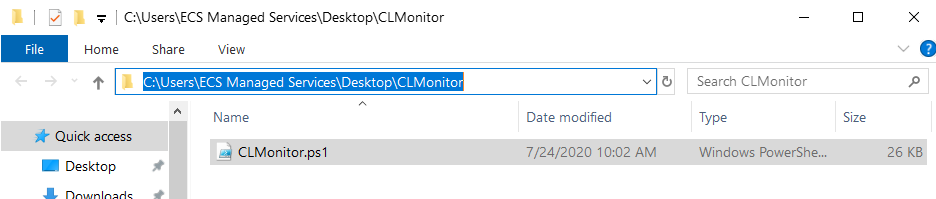

2.  Open CLMonitor.ps1 on a text editor and adjust these variables:

 $maxActive = 60
 $minBreak = 10
 $dayMin = Get-Date \'09:00\'
 $dayMax = Get-Date \'22:00\'

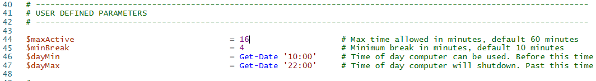

 Save the file
 

3.  Run Task Scheduler and add a task with the following properties:

  General:
    Name: ComLimites Monitor
    Description: ComLimites Monitor
    Select: Run Weather user is logged or not
    Check: Run with highest privileges
  
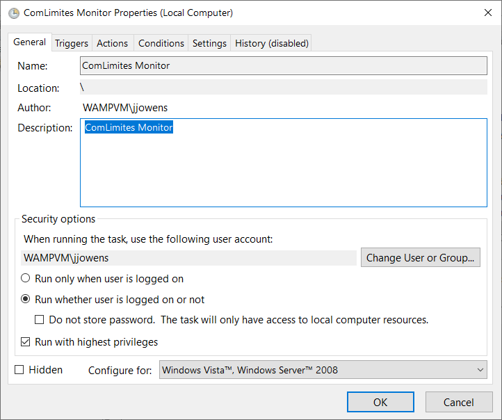

  Triggers:
  
   Begin the Task: At log on
   Specific user: \[Windows user to monitor\]

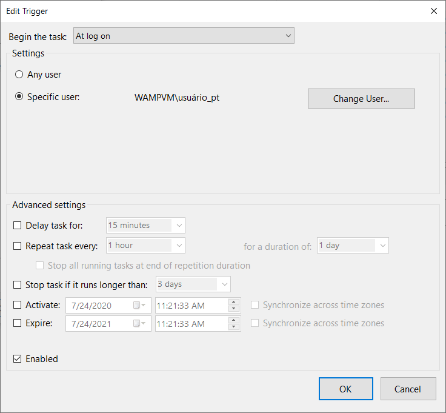

 Actions

  Action: Start a program
  Program/Script: PowerShell.exe
  Add arguments: -noprofile -executionpolicy bypass -file "x:\\path\\to\\script\\CLMonitor.ps1\" \"user name\"

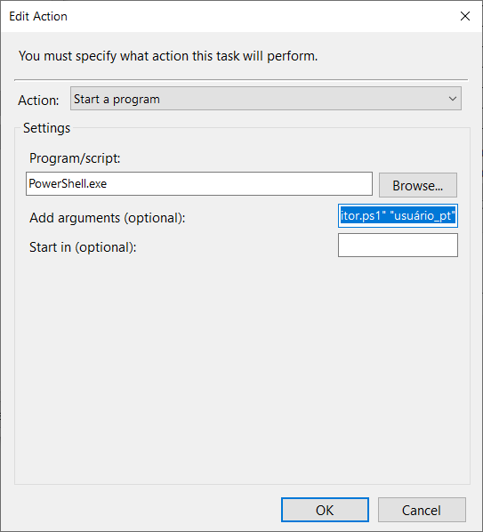

 Conditions:

 Uncheck: Start the task only if the computer is on AC power

 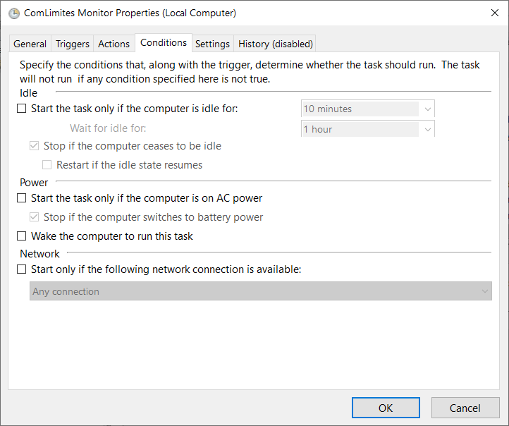

  Settings:
  Uncheck: Stop the task if it runs longer than:
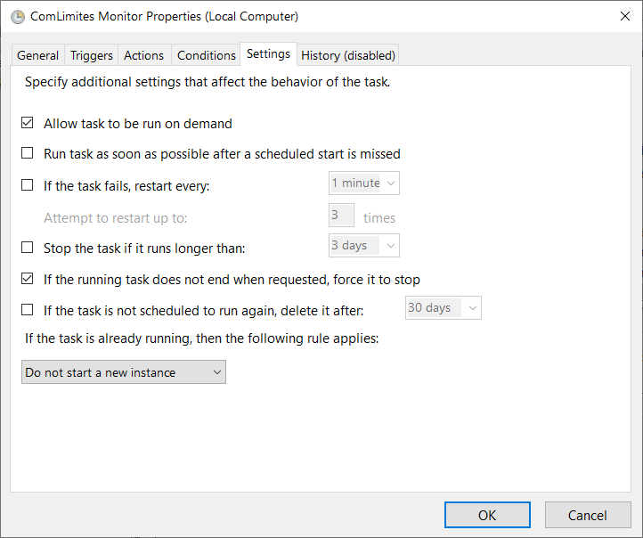

 Click OK to save, enter your admin user password

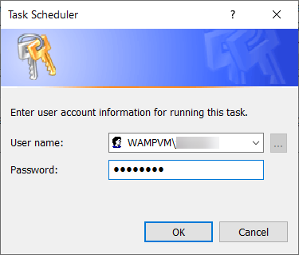

**CLClient Install:**

1.  Navigate and create the following folder:

   C:\\Users\\usuário_pt\\AppData\\Local\\ComLimites

2.  Copy CLClient.ps1 and the associated audio files to that folder

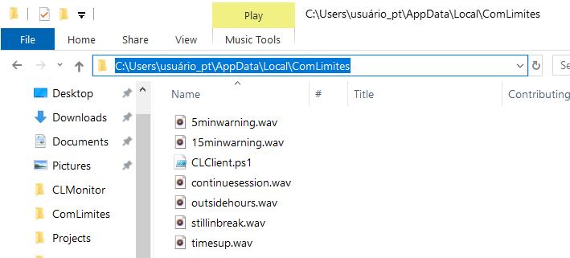

3.  In the user folder, right click and select New \> Shortcut. In the location field enter this:

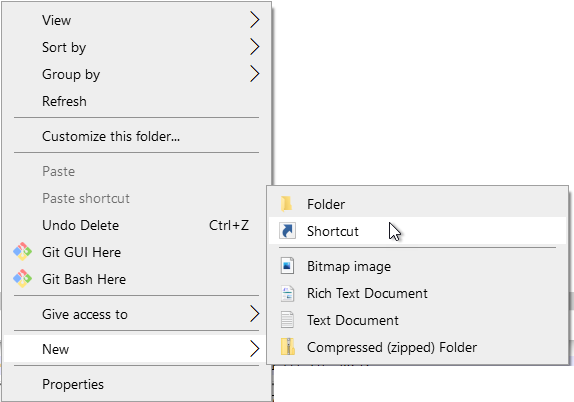

 PowerShell.exe -noprofile -executionpolicy bypass -file \"x:\\path\\to\\script\\CLClient.ps1\"

 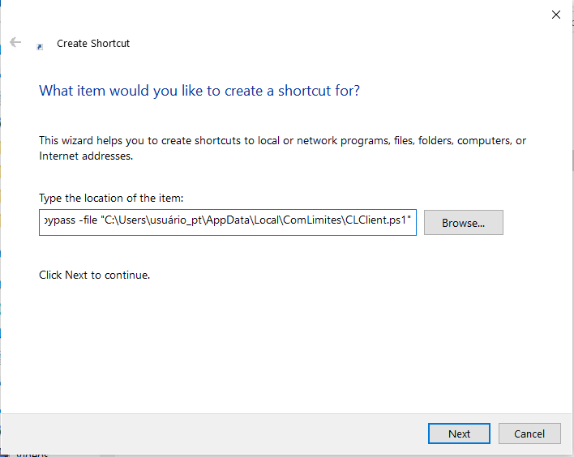

 Name the shortcut CLClient

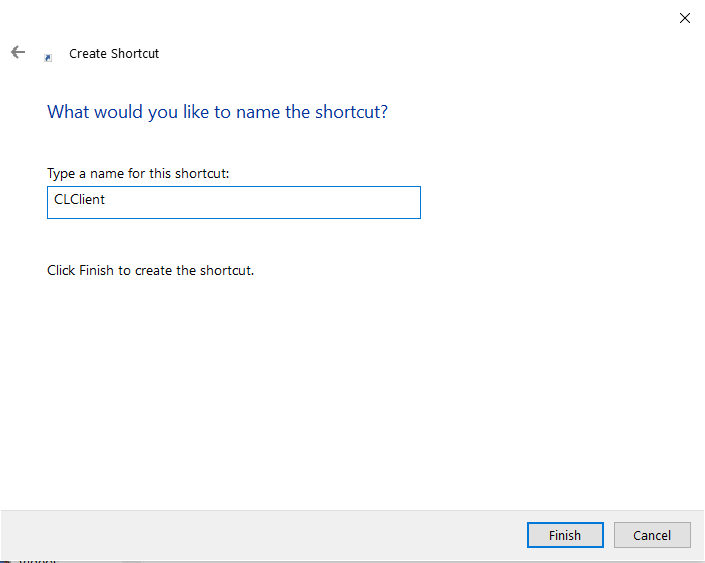

4.  Move the shortcut to the following folder:

  C:\\Users\\\[user name\]\\AppData\\Roaming\\Microsoft\\Windows\\Start Menu\\Programs\\Startup

